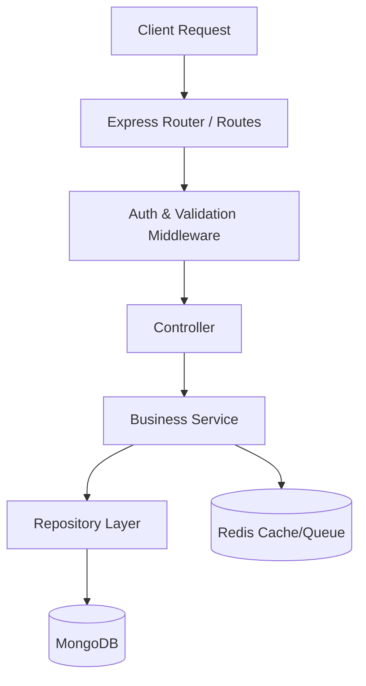
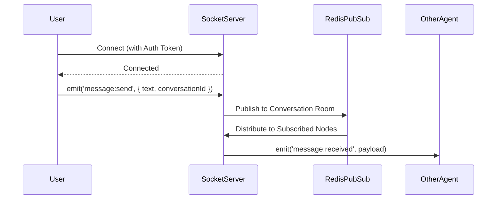
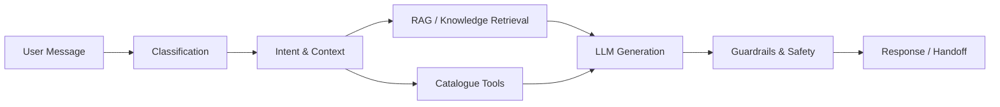

# Serviqo Architecture

## 1. Overview
Serviqo is a multi-tenant, AI-powered real-time customer support platform built as a monorepo. It features a modern tech stack centered around React, Node.js, MongoDB, and Redis, structured to support autonomous AI operations alongside human-agent assistance, real-time messaging, and robust deterministic automation.

## 2. Repository Structure
The project is structured as a monorepo to ensure seamless code sharing, consistent tooling, and unified versioning across frontend and backend applications.

- `apps/web/` — React + TypeScript + Vite + Tailwind CSS frontend
- `apps/server/` — Node.js + Express + TypeScript backend
- `packages/ui/` — Shared design system (components, tokens, icons, styles)
- `packages/types/` — Shared TypeScript type definitions
- `packages/config/` — Shared configuration
- `packages/validation/` — Shared validation schemas
- `infrastructure/` — Docker, Redis, database, monitoring, deployment configs
- `docs/` — Architecture docs, API docs, decision records
- `reference/` — Preserved design reference files (landing page prototype, tokens, design direction)
- `scripts/` — Build/dev/utility scripts
- `tests/` — Integration and E2E tests

## 3. Frontend Architecture
The web application is built with React and TypeScript, leveraging Vite for lightning-fast build and development cycles.

- **Styling**: Tailwind CSS, strictly guided by approved design tokens for visual consistency.
- **Experience Zones**: The application is code-split by distinct experience zones to prevent a monolithic component tree:
  - Marketing (`/`)
  - Authentication (`/auth`)
  - Customer Portal (`/customer/*`)
  - Agent Dashboard (`/app/*`)
  - Administration (`/admin/*`)
  - Help Center (`/help/*`)
- **Routing**: Professional routing layer (e.g., React Router) handles deep linking and protected route access.
- **State Management**: Client state is managed using a lightweight solution like Zustand, while server state and data fetching are handled by React Query / TanStack Query.

## 4. Backend Architecture
The backend is a Node.js + Express server written in TypeScript, following a clean, layered architecture.

- **Layered Flow**:
  Routes → Controllers → Services → Repositories → Models
- **Domain Modules**: Structured around distinct business domains including auth, organizations, users, customers, conversations, messages, tickets, departments, sla, notifications, uploads, analytics, and audit.
- **Automation Engine**: A deterministic system (separate from AI) that processes triggers, evaluates conditions, and executes actions.
- **AI Subsystem**: A comprehensive suite encompassing agents, orchestration, providers, RAG pipelines, embeddings, knowledge and catalogue intelligence, memory, tools, prompt management, guardrails, evaluation, and routing.

## 5. Data Architecture
Data is persisted in MongoDB using the Mongoose ODM, with Redis serving ephemeral data needs.

- **Primary Datastore**: MongoDB is the persistent source of truth.
- **Tenant Isolation**: Every document carries an `organizationId`. The Repository pattern enforces tenant scoping at the query level.
- **Redis Utility**: Used for presence tracking, Socket.IO adapter scaling, job queues (BullMQ/similar), caching, rate limiting, distributed coordination, and temporary state.

## 6. Real-Time Architecture
Real-time communication is critical for a support platform, handled via Socket.IO.

- **Connections**: Bidirectional real-time communication with authentication verified upon socket connection.
- **Routing & Isolation**: 
  - Organization rooms for tenant-wide events (isolation).
  - Conversation rooms for specific message routing.
- **Events**: Messages, typing indicators, presence, read receipts, assignments, queue changes, and ticket events.
- **Scaling**: A Redis adapter is utilized for horizontal scaling across multiple Node instances.
- **Reliability**: Built-in mechanisms for reconnection, missed-message sync, idempotency, duplicate protection, and guaranteed ordering.

## 7. Multi-Tenant Architecture
Serviqo is designed as a single deployment serving multiple organizations securely.

- **Resource Ownership**: `organizationId` exists on every tenant-owned resource.
- **Data Isolation**: Server-side enforcement is strictly applied at the repository layer (not just frontend filtering).
- **Scoped Operations**: Socket rooms, AI/RAG retrievals, and file storage are all explicitly scoped by the organization context.

## 8. Authentication & Authorization
Security is paramount, utilizing a robust, role-based access control (RBAC) system.

- **Tokens**: JWT-based authentication featuring short-lived access tokens and refresh token rotation, stored in secure HTTP-only cookies where appropriate.
- **Roles**: Centralized RBAC with distinct roles: Owner, Admin, Supervisor, Agent, Customer.
- **Permissions**: Granular permission-based authorization (e.g., `conversation.read`, `ticket.update`).
- **Enforcement**: Middleware enforces authorization rules on every HTTP route and Socket event. The system is designed to support custom roles and granular permissions in the future.

## 9. AI Architecture
The AI subsystem is provider-agnostic, built to operate in two distinct modes: Autonomous Support (handling customers directly) and Agent Assistance (augmenting human agents).

- **Orchestration Pipeline**:
  Classification → Automation Check → Intent Recognition → Context Gathering → RAG/Catalogue → LLM → Guardrails → Response/Handoff
- **Capabilities**: Features strict tool calling and guardrails (confidence thresholds, sensitive-operation restrictions, prompt injection defense).
- **RAG Pipeline**:
  Document Ingestion → Parsing → Chunking → Embedding → Vector Store → Retrieval → Reranking → LLM Context
- **Catalogue Intelligence**: Combines structured queries with vector search, ensuring data is retrieved accurately with zero tolerance for fabrication.

## 10. Automation Architecture
A determinisitic rules engine that operates completely independently of the AI subsystem to ensure predictability and zero LLM token consumption.

- **Pattern**: TRIGGER → CONDITIONS → ACTIONS
- **Triggers**: Event-driven hooks tied to conversation, message, or ticket lifecycles.
- **Conditions**: Evaluation logic against structured data properties.
- **Actions**: Automated routing, messaging, tagging, assignment, and status updates.

## 11. Security Architecture
Comprehensive security measures are implemented at every layer of the platform.

- **Isolation & Validation**: Strict tenant isolation and rigorous input validation on all routes.
- **Protection**: Rate limiting on sensitive endpoints and application of secure HTTP headers (CORS, CSP, etc.).
- **Uploads**: Server-side validation of file uploads (type, size, extension).
- **Auditing & Secrets**: Comprehensive audit logging for administrative and security events. Secret management via environment variables (no hardcoded secrets). Safe error responses guarantee no stack traces are exposed in production.

## 12. Observability
Visibility into system health and performance is crucial for the platform's reliability.

- **Logging & Tracking**: Structured JSON logging (avoiding native `console.log`) and dedicated error tracking.
- **Tracing**: Request IDs are generated and passed through for end-to-end tracing.
- **Metrics**: Monitoring critical metrics such as socket connections, queue depths, AI latency, and provider error rates.
- **Health Checks**: Standardized endpoints for orchestrator/load balancer health verifications.

## 13. Current State
**Phase 0 Complete.** The repository structure is fully established. Design reference files (tokens, UI direction, prototype) are preserved in the `reference/` directory. No implementation code exists yet.
